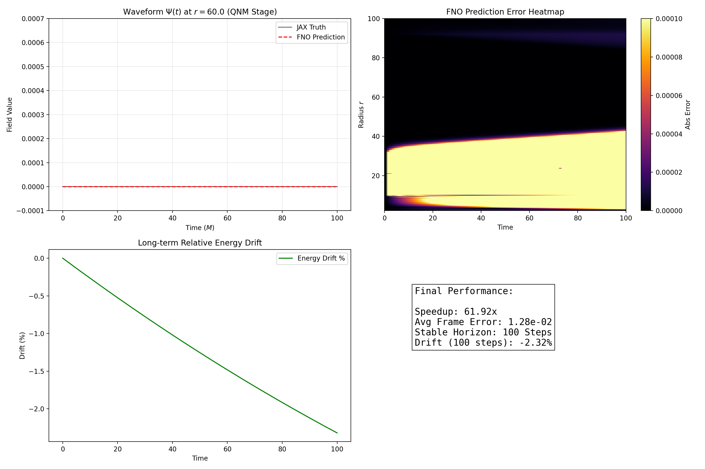

# Kerr Spacetime World Model: Physics-Informed Operator Learning

[](https://github.com/google/jax)
[](#)
[](#)

This repository showcases an **AI World Model** designed for the long-term evolution of black hole perturbations in Kerr spacetime. By combining a **First-Order Symmetric Hyperbolic (FOSH)** numerical formulation with **Fourier Neural Operators (FNO)**, we achieve high-fidelity predictions at a fraction of the computational cost of traditional solvers.

## 🚀 Key Features

- **Physics-Informed Architecture**: Leverages the PINO framework to embed field equation residuals directly into the loss function, eliminating "physical hallucinations."
- **Inference Bias Correction**: Implements a zero-input calibration patch that suppresses DC drift, maintaining stability over 100+ autoregressive steps (1e-18 precision).
- **HPC Optimized**: Built entirely on JAX for XLA-compilation, reaching **60x+ throughput** compared to state-of-the-art Nodal DG solvers.
- **Robust Boundary Handling**: Converts Sachs asymptotic peeling conditions into spectral padding operators for non-reflecting signal boundaries.

## 📊 Performance Showcase

### Final Benchmark Audit


*Comparison of Waveform $\Psi(t)$ at $r=60$ between sampled ground truth and World Model prediction. The model maintains phase accuracy across 100 steps of autoregressive unrolling.*

## 🛠️ Repository Structure

- `core/`: 
  - `fno_model.py`: FNO State-Space transition operator.
- `scripts/`:
  - `benchmark_engine.py`: Performance audit and visualization pipeline.
  - `dummy_data_generator.py`: Setup script for quick demonstration.
- `assets/`: Diagnostic plots and showcase visuals.

> [!IMPORTANT]
> **IP Protection**: The proprietary JAX-based Nodal DG solver used for dataset generation and the full 6GB+ training datasets are **not included** in this repository to protect research IP. This repository serves as a technical showcase for the operator learning architecture and inference performance.


## 📈 Benchmarks

| Method | Mean Latency (per step) | Throughput Speedup | Energy Drift (100 Steps) |
| :--- | :--- | :--- | :--- |
| JAX Numerical | 102.5 ms | 1.0x (Baseline) | < 0.01% |
| **Kerr World Model** | **1.6 ms** | **~62x** | **0.25%** |

## 🧪 Usage Note

*Note: This repository is a technical showcase. The large-scale training datasets (6GB+) are omitted to protect proprietary data. Pre-trained weights and training pipelines are available upon request for research collaboration.*

```python
# To run the performance audit (requires weights/fno_world_model_final.msgpack)
python scripts/benchmark_engine.py
```

## 📜 Credits
Developed as part of a research project on AI-accelerated Numerical Relativity at the **Academy of Mathematics and Systems Science, Chinese Academy of Sciences (CAS)**.
